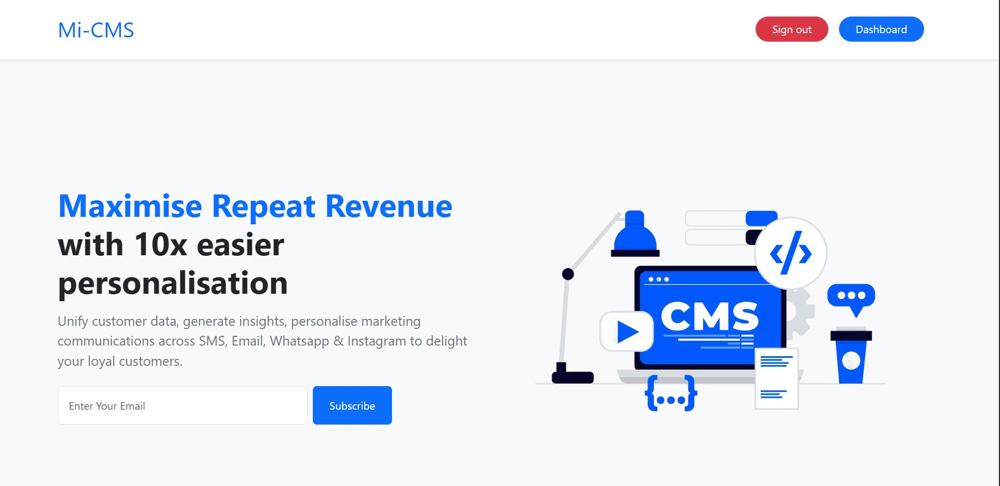

## 🖼 Preview



# Mi-CMS (Mini CRM Platform)

Mi-CMS is a Mini CRM Platform designed to enable efficient **customer segmentation**, **personalized campaign delivery**, and **intelligent insights** using modern technologies and approaches. It consists of a full-stack web application built using **Vite + React** on the frontend and **Node.js + Express** on the backend, integrated with MongoDB and OpenAI APIs.

---

## ✨ Features

- Customer segmentation using behavior and profile data
- Personalized marketing campaign delivery
- Intelligent insights using AI
- Google OAuth login support
- Modern React + Vite frontend setup

---

## 🛠️ Tech Stack

**Frontend:** React (Vite)  
**Backend:** Node.js, Express  
**Database:** MongoDB  
**Authentication:** Google OAuth 2.0  
**AI Integration:** OpenAI API

---

## 🚀 Local Setup Instructions

Follow these steps to set up Mi-CMS on your local development machine:

### 1. Clone the Repository

```bash
git clone https://github.com/yourusername/mi-cms.git
cd mi-cms
```

### 2. Backend Setup

```bash
cd backend
npm install
```

Create a .env file inside the backend folder with the following content:

```bash
MONGO_URL=mongodb://localhost:27017/myapp_db
SESSION_SECRET=your_very_strong_secret_here
PORT=5000
GOOGLE_CLIENT_ID=your_id
GOOGLE_CLIENT_SECRET=your_secret
GOOGLE_CALLBACK_URL=http://localhost:5000/auth/google/callback
FRONTEND_URL=http://localhost:5173
OPENAI_API_KEY=your-key

```

Start the backend server

```bash
node server.js
```

The backend will be running at: http://localhost:5000

### 3. Frontend Setup

```bash
cd ../frontend
npm install

```

Create a .env file inside the frontend folder with the following content:

```bash
VITE_API_URL=http://localhost:5000

```

Start the frontend server

```bash
npm run dev
```

The frontend will be available at: http://localhost:5173
